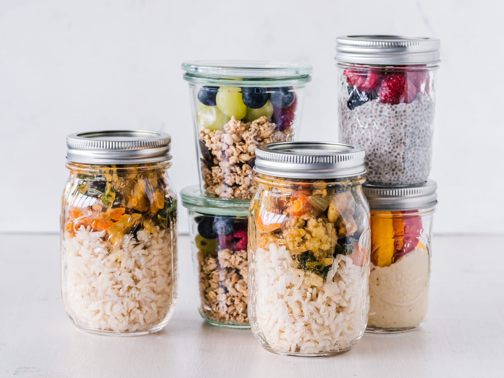

import imageLeslieAlexander from '@/images/team/leslie-alexander.jpg'

export const article = {
    date: '2023-07-20',
    title: 'Запрошуємо до співпраці швачок',
    description:
        'Ми шукаємо талановитих швачок для роботи в нашому сучасному ательє. Приєднуйтесь до нас та станьте частиною команди, що створює високоякісний одяг.',
    author: {
        name: 'Тетяна Петренко',
        role: 'Керівник відділу виробництва',
        image: { src: imageLeslieAlexander },
    },
}

export const metadata = {
    title: article.title,
    description: article.description,
}

## 1. Комфортні Умови Праці

Ми створили сучасне ательє з найновішим обладнанням, яке значно полегшує роботу наших швачок. Хоча виробництво одягу - це кропітка праця, ми постійно впроваджуємо інновації для підвищення комфорту наших співробітників.

Ми розуміємо, що якість роботи напряму залежить від умов праці, тому ми забезпечуємо ергономічні робочі місця, хороше освітлення та регулярні перерви.

<TopTip>
    У нас є спеціальна кімната відпочинку, де ви можете розслабитися під час перерви. Там є навіть масажні крісла для зняття напруги після роботи!
</TopTip>

## 2. Можливості для Професійного Росту

Ми цінуємо досвід, але також завжди раді бачити нові таланти. У нас є програма навчання для новачків, де досвідчені майстри діляться своїми знаннями та секретами майстерності.

Ми заохочуємо наших співробітників розвиватися та освоювати нові техніки шиття. Регулярно організовуємо майстер-класи та тренінги для підвищення кваліфікації наших швачок.

## 3. Конкурентна Заробітна Плата та Бонуси

Ми пропонуємо конкурентну заробітну плату, яка залежить від вашого досвіду та продуктивності. Крім того, у нас є система бонусів за виконання складних замовлень та перевиконання плану.

Ми також забезпечуємо наших співробітників повним соціальним пакетом, включаючи медичне страхування та оплачувану відпустку. А ще у нас є чудова традиція - щомісячний конкурс на звання "Кращий швачка місяця" з приємним грошовим призом.

